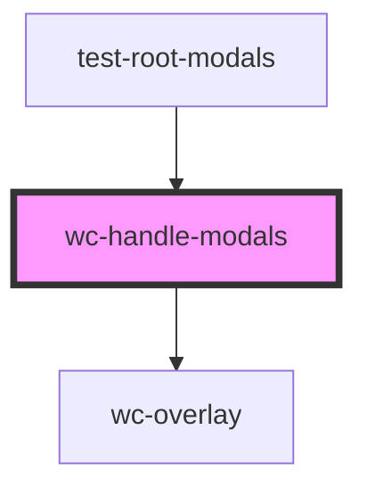

# wc-handle-modals

<!-- Auto Generated Below -->

## Methods

### `addModal(tagModal: string, options?: { overlap: boolean; }) => Promise<void>`

#### Returns

Type: `Promise<void>`

## Dependencies

### Used by

 - [test-root-modals](../test-root-modals)

### Depends on

- [wc-overlay](../wc-overlay)

### Graph

----------------------------------------------

*Built with [StencilJS](https://stenciljs.com/)*
