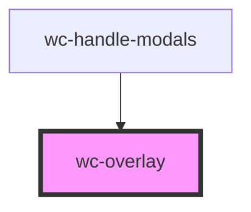

# wc-overlay

<!-- Auto Generated Below -->

## Properties

| Property      | Attribute      | Description | Type      | Default |
| ------------- | -------------- | ----------- | --------- | ------- |
| `showOverlay` | `show-overlay` |             | `boolean` | `true`  |

## Methods

### `activeIsShow() => Promise<void>`

#### Returns

Type: `Promise<void>`

### `cleanChildModals() => Promise<void>`

#### Returns

Type: `Promise<void>`

### `closeModal(id: string) => Promise<void>`

#### Returns

Type: `Promise<void>`

### `deactiveIsShow() => Promise<void>`

#### Returns

Type: `Promise<void>`

### `getChildModals() => Promise<Node[]>`

#### Returns

Type: `Promise<Node[]>`

## Dependencies

### Used by

 - [wc-handle-modals](../wc-handle-modals)

### Graph

----------------------------------------------

*Built with [StencilJS](https://stenciljs.com/)*
