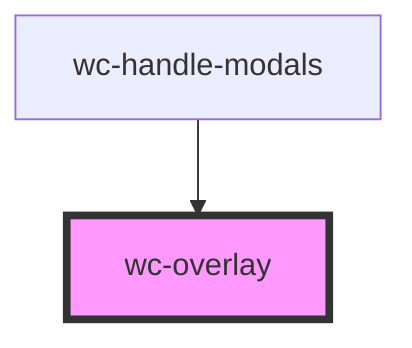

# wc-overlay

<!-- Auto Generated Below -->

## Properties

| Property | Attribute | Description | Type      | Default     |
| -------- | --------- | ----------- | --------- | ----------- |
| `isShow` | `is-show` |             | `boolean` | `undefined` |

## Dependencies

### Used by

 - [wc-handle-modals](../wc-handle-modals)

### Graph

----------------------------------------------

*Built with [StencilJS](https://stenciljs.com/)*
